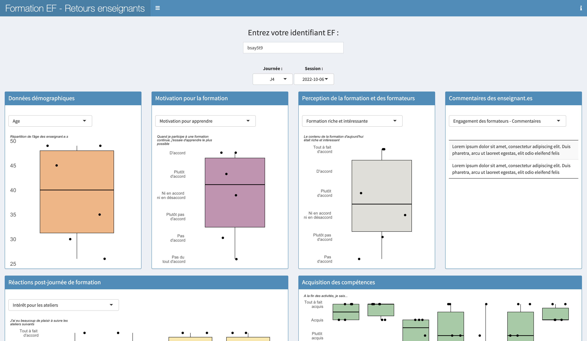

# French version

## Fonctionnement général

Les tableaux de bord "enseignants-formateurs" sont des applications R Shiny interactives permettent de disposer d'un retour en temps réel de sondages SurveyMonkey sous forme de visualisations graphiques.



## Mise en marche rapide

Télécharger le tableau de bord de votre choix (ef_phase1_dashboard.R ou ef_phase2_dashboard.R) dans R Studio et les données fictives qui s'y rapportent (data_ef_d1_random.rds ou data_ef_d2_random.rds). Placer le script et les données dans un même fichier. Lancer le tableau de bord avec R Studio. Indiquez un identifiant EF, correspondant à un code unique donné à un binôme d'enseignants formateurs pour accéder à leur données uniquement. La liste des identifiants est présente dans le script :

```R

observe({
    
    if (input$id %in% c("5090on3",
                        "6ev1wd5",
                        "bsay5t9",
                        "34vnyfj",
                        "xt8tb0u",
                        "4d9ug6k",
                        "ug8a6dr",
                        "z9jza5v",
                        "zoehjqg",
                        "6hz3qkm",
                        "hg0ybjf",
                        "3yufg4t",
                        "svx837j",
                        "40aw4kh",
                        "s1v9vnj",
                        "p2jie1k",
                        "omos3ix",
                        "2l0xtqz",
                        "43omp4v",
                        "8c4kpz3")) {

```

Ce code est une variable personnalisée SurveyMonkey (voir https://help.surveymonkey.com/fr/surveymonkey/send/custom-variables/) inclus dans l'url du sondage envoyé aux enseignants ayant suivi la formation avec un binôme d'enseignants formateurs donné. Cela permet ensuite de sélectionner les données correpondant à un binôme d'enseignants formateurs en particulier sur le tableau de bord en indiquant l'identifiant EF en question. 

# Marche à suivre pour utiliser les tableaux de bord

## Fonctionnement détaillé

### ef_phase1_dashboard.R

L'application accède directement aux données d'un sondage SurveyMonkey réalisé préalablement (voir survey_ef_d1.pdf).

Lorsque lancé, le tableau de bord met à jour via l'API de SurveyMonkey les données récoltées. Ces données sont stockées dans un fichier *data_ef_d1.rds* lu et mis à jour par l'application. 

Pour faire tourner l'application avec des données réelles, vous pouvez donc remplacer dans le script le nom *data_ef_d1_random* (données fictives) par *data_ef_d1*. 

## Accès à l'API de SurveyMonkey

L'accès à l'API nécessite la création d'une app sur le compte https://developer.surveymonkey.com/apps/

Pour se connecter à l'API, vous devez récupérer les identifiants de votre app SurveyMonkey et les utiliser pour compléter le script :

- Access Token (sm_api_key)
- Secret (sm_secret)
- Client ID (sm_client_id)

## Trouver les identifiants de votre sondage et votre collecteur

Une fois votre sondage SurveyMonkey créé et ouvert, il possède un id spécifique ainsi qu'un ou plusieurs collecteurs. Chaque collecteur possède également un id spécifique. Pour récupérer ces id, lancer la partie du script mis en commentaire FIND SURVEYS AND COLLECTOR IDS

```R
#######################  FIND SURVEYS AND COLLECTORS IDS  ################

# Once used, you can comment this part of code, you do not need it anymore

# Get the list of surveys to find the id of the wanted survey

surveys_details <- "https://api.surveymonkey.com/v3/surveys/"
n_surveys <- content(GET(surveys_details,add_headers(Authorization = paste0("Bearer ", sm_api_key))),"parsed")$total # Number of surveys

n_pages_surveys <- n_surveys %/% 50 + ifelse(n_surveys %% 50 > 0, 1,0) # Number of pages of surveys

connectApiUrl <- c()
for (i in 1:n_pages_surveys) {

  connectApiUrl <- c(connectApiUrl,paste0("https://api.surveymonkey.com/v3/surveys?page=",i))

}

content_urls <- list()
for (i in 1:length(connectApiUrl)) {

  content_urls <- append(content_urls,list(content(GET(connectApiUrl[i],add_headers(Authorization = paste0("Bearer ", sm_api_key))),"parsed")))

}

surveys <- data.frame()
for (i in 1:length(content_urls)) {

  surveys <- rbind(surveys, data.frame(title=unlist(lapply(1:length(content_urls[[i]]$data), function(x) {content_urls[[i]]$data[[x]]$title})),url=unlist(lapply(1:length(content_urls[[i]]$data), function(x) {content_urls[[i]]$data[[x]]$href}))))

}

surveys # Display a data frame with all the surveys and the associated urls (more recent survey first). The id of your survey is indicated at the end of the url corresponding to your survey of interest

# Get the collectors for a given survey

survey_id <- "" # Indicate here your survey id

collectors <-paste0("https://api.surveymonkey.com/v3/surveys/",survey_id,"/collectors")
content_collectors <- content(GET(collectors,add_headers(Authorization = paste0("Bearer ", sm_api_key))),"parsed")

content_collectors$data[[1]]$id  # the id of the first collector of your survey

#########################################################################

```

## Adapter le tableau de bord à votre propre sondage

Le script doit être adapté aux questions de votre sondage. Trois types de questions sont traitées ici. Ils ne couvrent pas l'ensemble des types de questions possibles proposés par SurveyMonkey qui peuvent nécessiter une modification spécifique du script. 

### Structure des questions

Lorsque l'application met à jour les données via l'API de SurveyMonkey, les données sont stockées dans une liste puis via cette liste est créé un data frame appelé *data* enregistré dans le fichier *data_ef_d1.rds*. Les colonnes de *data* correspondent à une ou plusieurs questions de votre sondage.

Dans SurveyMonkey, chaque valeur des questions de type *case à cocher* (plusieurs valeurs peuvent être sélectionnées) possède une colonne spécfique. Par exemple, pour la question 2 (voir survey_ef_d1.pdf) *Dans quel établissement enseignez-vous?, les répondants peuvent indiqués 1 ou plusieurs degrés (de 1P à 12S) (voir code ci-dessous).

Au contraire, les questions de type *choix multiple* (une seule valeur parmi celles proposées peuvent être sélectionnées) possèdent une seule colonne correpondant à la valeur choisie. Par exemple, pour la question 3 (voir survey_ef_d1.pdf) *Quand je participe à une formation continue, j'essaie d'apprendre le plus possible*,les répondants peuvent choisir une seule réponse sur l'échelle de Likert proposée et la colonne correspondante est *motivation* (voir code ci-dessous).

Les questions de type *Matrice/échelle d'évaluation* sont similaires aux questions *choix multiple*. Chaque question de la matrice possède une seule colonne correspond à la valeur choisie. Par exemple, la question 5 (voir survey_ef_d1.pdf) *Le contenu de la formation d'aujourd'hui*, les colonnes correspondantes sont *contenu_riche* et *contenu_adapte*. Pour cette matrice, la possiblité de laisser un commentaire a également été ajoutée, celui-ci possède également une colonne spécifique *appreciation_generale_commentaires*.


```R

#Questions

   columns <- c("journee",
                "date",
                "id_binome",
                "age",
                "experience",
                "etablissement",
                "degre_1P",
                "degre_2P",
                "degre_3P",
                "degre_4P",
                "degre_5P",
                "degre_6P",
                "degre_7P",
                "degre_8P",
                "degre_9S",
                "degre_10S",
                "degre_11S",
                "degre_12S",
                "motivation",
                "utilite_techno",
                "contenu_riche",
                "contenu_adapte",
                "appreciation_generale_commentaires",
                "engagement_formateurs",
                "engagement_formateurs_commentaires",
                "liens_formation_pratique",
                "liens_formation_pratique_commentaire",
                "interet_pratiques",
                "interet_algorithmes",
                "interet_partages",
                "interet_scratch",
                "interet_activites_commentaires",
                "utilite_pratiques",
                "utilite_algorithmes",
                "utilite_partages",
                "utilite_scratch",
                "utilite_activites_commentaires",
                "confiance_pratiques",
                "confiance_algorithmes",
                "confiance_partages",
                "confiance_scratch",
                "confiance_activites_commentaires",
                "competence1",
                "competence2",
                "acquisition_pratiques_commentaires",
                "competence3",
                "competence4",
                "competence5",
                "acquisition_algorithmes_commentaires",
                "competence6",
                "competence7",
                "acquisition_partage_commentaires",
                "utiliser_nouveaux_apprentissages",
                "intention_pratiques",
                "intention_algorithmes",
                "intention_partages",
                "intention_scratch",
                "intention_utilisation_commentaires",
                "adoption_charte",
                "adoption_livre",
                "adoption_machine",
                "adoption_jeu",
                "adoption_orchestration",
                "adoption_bestioles",
                "adoption_thymio",
                "adoption_bluebot",
                "adoption_edunum",
                "adoption_utiliser_application",
                "adoption_chope_pub",
                "adoption_ecrans",
                "adoption_tapis",
                "adoption_stopmotion",
                "adoption_album_loupe",
                "adoption_album_livre",
                "adoption_album_pfff",
                "adoption_pasconcerne",
                "conditions_compatibilite",
                "conditions_soutien",
                "conditions_charge",
                "conditions_plusvalue")
```


### Récupérer les données par type de questions

Les données du sondage récupérées via l'API sont stockées sous forme de liste dans la variable *content_responses*. L'accès aux réponses pour chaque question permet de remplir le data frame *data* (une ligne par participant) dont le nom des colonnes est présentée au dessus.

L'accès à une réponse donnée se fait de la façon suivante :

```R

content_responses[[n_batch]]$data[[i]]$pages[[1]]$questions[[2]]$answers[[3]]$simple_text

```

n_batch correspond à quel batch de questions on accède (un batch correspond aux réponses de 50 participants dans SurveyMonkey)   
i est l'indice du participant    
1 est l'indice de la page choisie dans le sondage    
2 est l'indice de la question choisie dans la page   
3 est l'indice de la réponse choisie dans la question    

Le commentaire inclu dans la question est la dernière *answers*.

Selon vos questions et leurs types, il faut faire correspondre la réponse obtenue via l'accès à la liste *content_responses* à vos noms de colonnes (voir partie précédente).

Dans l'API de SurveyMonkey, les questions n'ayant pas obtenues de réponses ne sont pas enregistrées en tant que NA. L'accès n'existe simplement pas et la tentative d'accès renvoie une erreur. Pour remplacer cette erreur par une valeur NA, chaque accès à la liste content_responses est entourée d'un try-catch retournant la valeur NA lorsque l'accès n'existe pas. 

```R
tryCatch(
         content_responses[[n_batch]]$data[[i]]$pages[[2]]$questions[[2]]$answers[[1]]$simple_text,
         error = function(e){return(NA)}
       ), 
```

Dans cette exemple, l'accès à *content_responses* renvoie la réponse 1 pour la question 2 du sondage : Dans quel établissement enseignez-vous? correspond à la colonne "etablissement" dans les noms de colonnes (voir partie précédente). 

### Construction des graphiques

Les représentations graphiques prennent en entrée une partie des données du data frame *data* correspond aux choix réalisés par l'utilisateur (identifiant EF, journée en question, etc.) et les valeurs pour la ou les colonnes d'intérêt (par exemple la colonne *experience* du data frame *data* correspond ici au nombre d'années d'expérience des enseignants formées). Cette variable *experience* est représentée graphiquement sous forme de boxplot avec la librarie ggplot2.

```R

if (input$demographie == "Experience d'enseignement") {
          
          p <- ggplot(data[data$id_binome==input$id&data$journee==input$journee&data$date==input$session,], aes(x=id_binome, y=as.numeric(experience)))  +
            geom_boxplot(fill='#F59138', color="black", alpha=0.7, outlier.shape = NA) +
            geom_jitter(shape=16, size=3, position=position_jitter(width = 0.3, height = 0)) +
            ggtitle(str_wrap("Répartition des enseignant.e.s par établissement",40)) +
            theme_minimal() +
            theme(plot.title.position = "plot",
                  plot.title = element_text(face = "italic",size = 10),
                  legend.position = "none",
                  axis.title.x=element_blank(),
                  axis.title.y=element_blank(),
                  axis.text.x = element_blank(),
                  axis.text.y = element_text(size=16),
                  #plot.background = element_rect(fill = "#ECF0F5",color = "#ECF0F5"),
                  #panel.background = element_rect(fill = "#ECF0F5", color = "#ECF0F5"),
                  panel.grid.major = element_blank(),
                  panel.grid.minor = element_blank())
          
          return(p)
```

 
## Mettre en ligne l'application

L'application peut fonctionner en local et en ligne. Pour la rendre disponible en ligne, la solution la plus simple est de la télécharger sur la plateforme https://www.shinyapps.io. Pour cela, dans R Studio, cliquer sur le bouton bleu *Publish options* à côté du bouton Run app. Cliquez sur Add New Account puis ShinyApps.io puis suivre la procédure indiquée. Une fois le compte ajouté, sélectionnez le fichier ef_phase1_dashboard.R. Si vous avez déjà enregistré une partie des données localement, ajoutez également le fichier data_ef_d1.rds. Donnez un titre à votre application et cliquez sur Publish. Par défaut, l'application s'ouvre dans votre navigateur par défaut lorsque la compilation est terminée. 


### ef_phase2_dashboard.R

Le tableau de bord ef_phase2_dashboard.R est similaire au tableau de bord ef_phase1_dashboard.R. Seuls les intitulés et le nombre de questions posées dans le questionnaire changent. 
