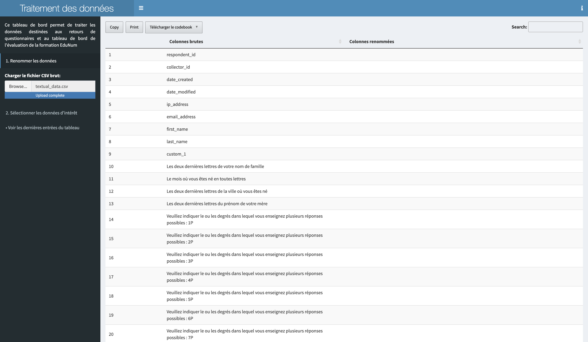

# French version

## Fonctionnement général

Le tableau de bord "traitement des données" est une application R Shiny interactive destinée à faciliter le traitement de données .csv brutes issues d'un sondage SurveyMonkey

## Marche à suivre pour utiliser le tableau de bord

### Fonctionnement détaillé

#### Téléchargement des données brutes sur SurveyMonkey

Dans SurveyMonkey, allez dans Analysez les résultats puis Enregistrer sous -> Fichier d'exportation -> Toutes les réponses indivduelles -> Exporter avec la configuration suivante.

  

Un fenêtre s'affiche. Cliquez sur le bouton Télécharger, un fichier intitulé Données_Tous_XXXXXX.zip se télécharge. Décompressez ce fichier et ne conservez que le fichier .csv portant comme nom l'intitulé du sondage. Renommez-le *textual_data.csv*.

Il peut être intéressant de conserver également une copie .pdf du sondage. Pour ce faire allez dans Concevez un sondage et cliquez sur l'icône d'impression en bas à gauche. Définissez les options de votre choix et cliquez sur le bouton Télécharger le PDF.

#### Lancer le tableau de bord

Ouvrir le fichier processing-dashboard.R. Cliquez sur Run App. L'application s'ouvre dans votre navigateur par défaut. 

Cliquez sur Browse... sous Charger le fichier CSV brut:. Sélectionner votre fichier *textual_data.csv* puis cliquez sur Ouvrir. Un tableau s'affiche contenant une colonne intitulée Colonnes brutes et une autre intitulée Colonnes renommées. La colonne Colonnes brutes contient les intitulés des questions du sondage SurveyMonkey. Les questions de type à cocher possède une colonne par case à cocher appartenant à la même question. 

Il est possible de supprimer certaines colonnes en les sélectionnant et en cliquant sur Supprimez les colonnes inutiles tout en bas de la page. 

Pour faciliter l'analyse des données, les intitulés des questions de la colonne Colonnes brutes doivent être renommés plus simplement selon la nomenclature de votre choix. Par exemple, Pour renommer une colonne, double cliquez dans la colonne Colonnes renommées en face de l'intitulé que vous souhaitez renommer.

Une fois toutes les colonnes renommées, vous pouvez télécharger un codebook conservant ce tableau. Pour cela, cliquez sur Télécharger le codebook et choisissez le format de sortie souhaité. Enfin, cliquez en bas de la page sur Télécharger le fichier renommé. Un fichier .csv intitulé renamed.csv dans est sauvegardé dans le même dossier que le fichier processing-dashboard.R. 

